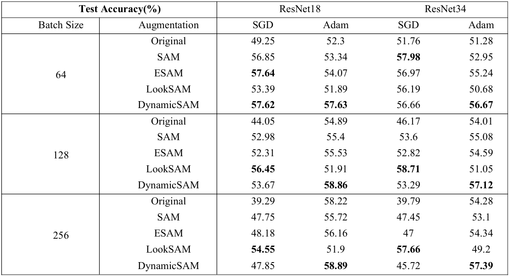
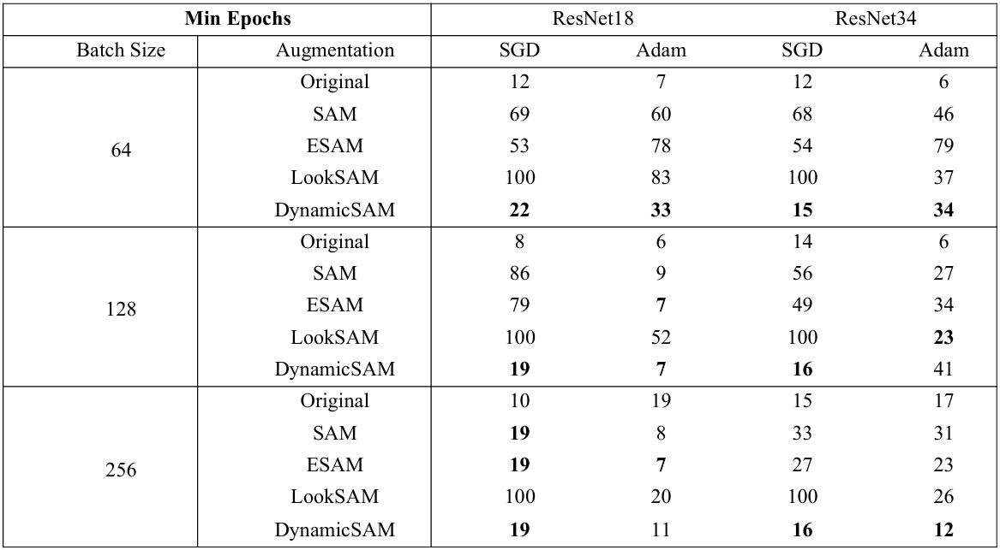

# 实验环境

## 系统环境

+ Ubuntu 20.04
+ 4 * NVIDIA GeForce RTX 3090

## 所需依赖

+ matplotlib==3.9.3
+ torch==2.5.1
+ torchvision==0.20.1

在项目目录下，输入下面的指令完成依赖包下载

``` bash
pip install -r requirements.txt
```

# 数据集下载

CIFAR_100 [官方地址](https://www.cs.toronto.edu/~kriz/cifar.html)

不需要手动下载，运行代码会自动在 `./data` 中自动下载

# 运行方式

## 训练模型

在 'train.py' 中，修改相关参数配置训练环境

``` python
# sgd adam sam_sgd sam_adam esam_sgd esam_adam looksam_sgd looksam_adam dynamicsam_sgd dynamicsam_adam
METHOD = 'looksam_adam'
# resnet18 resnet34
MODEL = 'resnet34'
# 64 128 256
BATCH_SIZE = 256
NUM_EPOCHS = 100
DEVICE = torch.device('cuda:0' if torch.cuda.is_available() else 'cpu')

LOG_DIR = f'log/{MODEL}/{BATCH_SIZE}'
RESULT_DIR = f'result/{MODEL}/{BATCH_SIZE}'
PICTURE_DIR = f'picture/{MODEL}/{BATCH_SIZE}'
WEIGHT_DIR = f'weight/{MODEL}/{BATCH_SIZE}'
```

在项目目录下，终端输入 `python train.py` 即可运行训练模型。

训练时，在 `LOG_DIR` 文件夹中保存日志，在 `RESULT_DIR` 文件夹中保存每轮训练在训练集和测试集上的 loss 和 accuracy，在 `PICTURE_DIR` 文件夹中保存使用 loss 和 accuracy 的绘图结果，在 `WEIGHT_DIR` 文件夹中保存训练完成的模型。

## 绘图对比

在 `draw_picture.py` 中，修改相关参数配置绘图目标

``` python
METHODS_SGD = ['sgd', 'sam_sgd', 'esam_sgd', 'looksam_sgd', 'dynamicsam_sgd']
METHODS_ADAM = ['adam', 'sam_adam', 'esam_adam', 'looksam_adam', 'dynamicsam_adam']

MODEL = 'resnet18' # resnet18 resnet34
BATCH_SIZE = 256 # 64 128 256
EPOCHS = 100
DRAW_STEP = 10

RESULT_DIR = f'result/{MODEL}/{BATCH_SIZE}'
PICTURE_DIR = f'picture_comparison/{MODEL}/{BATCH_SIZE}'
SGD_PICTURE_PATH = f'{PICTURE_DIR}/SGD'
ADAM_PICTURE_PATH = f'{PICTURE_DIR}/ADAM'
```

在项目目录下，终端输入 `python draw_picture.py` 即可运行绘制训练对比图。

`draw_picture.py` 会读取 `RESULT_DIR` 中的训练数据，将在 `METHODS_SGD` 中的各种优化方法下，训练过程中在训练集和测试集上的 loss 的 accuracy 绘图并保存在 `SGD_PICTURE_PATH` 文件夹；将在 `METHODS_ADAM` 中的各种优化方法下，相关数据绘图并保存在 `ADAM_PICTURE_PATH` 文件夹。

# 实验结果

此处放总实验结果，包括模型训练完成后在测试集上的准确率（Test Accuracy）和模型达到这一准确率需要的最少训练轮次（Min Epochs）。实验过程及分析见报告。

## Test Accuracy



## Min Epochs


